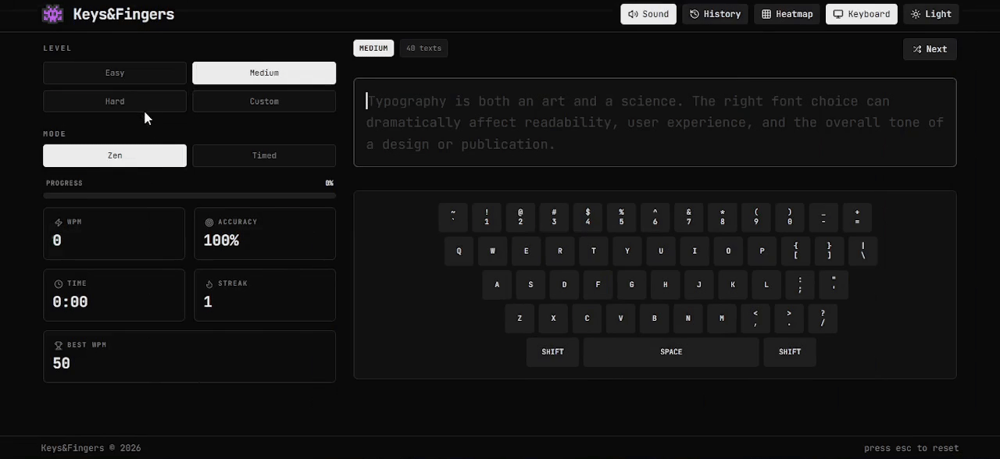
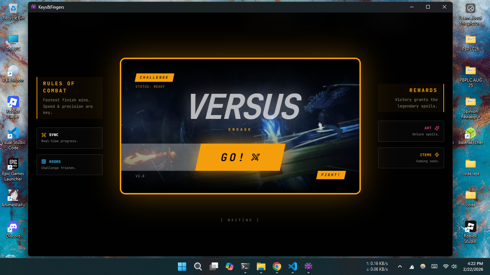

<div align="center">
  

  `Keys&Fingers` advanced, customizable, open source, free typing trainer with multiplayer battle mode.

  

  ## Play Keys&Fingers + docs

  **[https://docs-keysandfingers.netlify.app](https://docs-keysandfingers.netlify.app)**

  **[https://iamovi.github.io/KeysAndFingers/](https://iamovi.github.io/KeysAndFingers/)**

  ## Download Keys&Fingers

  

  **[https://github.com/iamovi/KeysAndFingers/releases](https://github.com/iamovi/KeysAndFingers/releases)**

---

```md
## features ##

i. real-time vs mode Room system with live sync.

ii. advanced theme engine with google fonts and glassmorphism.

iii. automated waifu rewards with skeleton loading screens.

iv. battle intro gif with tactical briefing panels.

v. performance tracking with analytics and heatmaps.

vi. multiple difficulty levels and custom text support.

vii. mobile optimized interface and sound effects.
```

---



**released under [MIT](./LICENSE) License,**

**crated by [Ovi ren](https://iamovi.github.io)**

  
</div>

