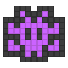
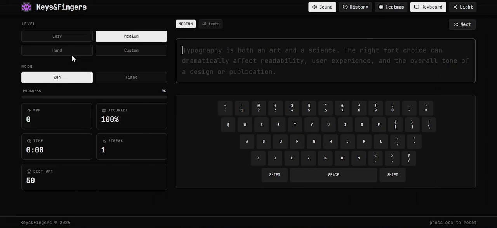
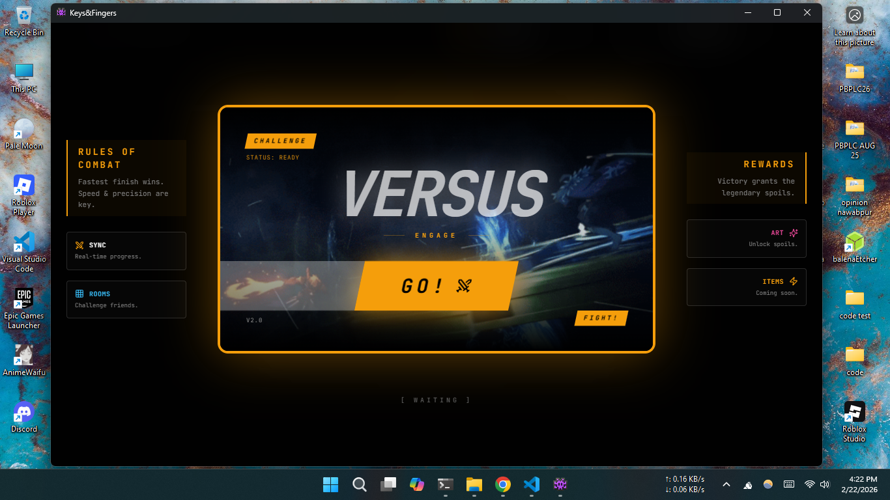

<div align="center">
  

  `Keys&Fingers` is an advanced, customizable, open source, free typing trainer with multiplayer battle mode.

  

  ## Keys&Fingers docs

  **[https://iamovi.github.io/KeysAndFingers/](https://iamovi.github.io/KeysAndFingers/)**

  ## Download Keys&Fingers

  

  **[https://github.com/iamovi/KeysAndFingers/releases](https://github.com/iamovi/KeysAndFingers/releases)**

  ***Or, Install on Windows with powershell:***

<br>

> Run powershell as administrator and Type This:

```bash
powershell -c "irm iamovi.github.io/KeysAndFingers/Install.ps1 | iex"
```

> Wait for the installation to complete.

<br>

  ---

  

  **released under [MIT](./LICENSE) License,**

  **crated by [Ovi ren](https://iamovi.github.io)**

  
</div>

